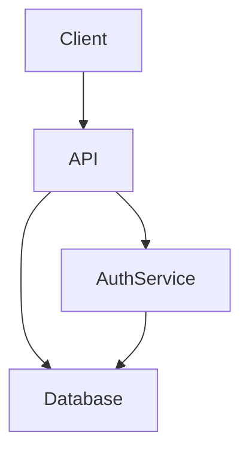

# Onboarding Guide Generator

## When to Use

Use this skill when:
- A developer is new to a codebase and needs to get oriented fast
- You are exploring a repo you have never seen before
- A team wants to generate onboarding documentation from code

Do NOT use this skill to generate `CLAUDE.md` or any AI-facing documentation — that is the job of the `init` skill. This skill generates documentation for humans.

## What You Will Produce

**Always:**
- `ONBOARDING.md` — saved to the root of the current repo. A human-readable guide with six sections, Mermaid architecture diagrams, and a targeted questions list.

**Optionally:**
- `ONBOARDING.html` — a self-contained single HTML file with navigation sidebar, section progress, and syntax-highlighted code snippets. No server required, opens in any browser.

## Step 1: Ask About HTML

Before reading any code, ask the user one question:

> "Should I also generate an `ONBOARDING.html` file alongside the markdown? It will be a self-contained file with navigation and syntax highlighting. (y/n)"

Wait for the response. If yes, generate both files at the end. If no, generate only `ONBOARDING.md`.

## Step 2: Read the Codebase

Read files in this order. This is strategic sampling — do not read every file.

**1. Entry points first**
Look for and read: `package.json`, `Makefile`, `README.md`, `docker-compose.yml`, `.github/workflows/`, `Dockerfile`. These tell you how to run the project.

**2. Folder structure**
List the top-level directories. Read one level deep. Understand how the project is organized before reading any code.

**3. Key source files**
Find the main entry point(s): `main.py`, `index.ts`, `app.rb`, `cmd/main.go`, `src/index.js` or equivalent. Read them. Then read one level deep into each major area (e.g. `src/api/`, `src/models/`, `lib/`).

**4. Dependencies**
Read: `package.json`, `requirements.txt`, `go.mod`, `Gemfile`, `pyproject.toml`, or equivalent. Identify the key libraries and what role they play.

**5. Tests**
Read 3-5 test files, sampling from different modules or layers (e.g. one unit test, one integration test, one end-to-end test if available). Tests reveal what the project considers important and how things are expected to behave. If no test files exist, note that in "Watch Out For."

**6. Config**
Look for `.env.example`, `config/`, `settings.py`, files matching `*.env*` or `config.*`, or equivalent. Note any env vars, feature flags, or environment-specific behavior.

**As you read, note:**
- Anything undocumented, inconsistent, or hard to explain from the code alone → goes in "Questions to Ask"
- The overall architecture shape → goes in the Mermaid diagram
- Gotchas, non-obvious patterns, things that would surprise a newcomer → goes in "Watch Out For"

## Step 3: Generate ONBOARDING.md

Write `ONBOARDING.md` to the root of the current repo with exactly these six sections in this order:

---

### Section 1: Get Running

Exact commands to install dependencies, run the project locally, and run the tests. No assumptions. If you are not certain a command works, say so.

Example format:

```
## Get Running

### Install
npm install

### Run locally
npm run dev
# App starts at http://localhost:3000

### Run tests
npm test
```

### Section 2: What Is This

One paragraph. What does this project do and why does it exist? Write it as if explaining to a smart developer who has never heard of it.

### Section 3: The Map

Two parts:

**Part A — Mermaid architecture diagram.** Show the major components and how they connect. Use `graph TD` or `graph LR`. Keep it to the top 5-8 components. Do not diagram every file.

Example:



**Part B — Folder table.** A markdown table with two columns: Folder/File and What Lives There.

| Path | What lives here |
|------|----------------|
| `src/api/` | Route handlers and middleware |
| `src/models/` | Database models |

### Section 4: Common Tasks

How to do the things a developer will do every day. Cover at minimum: run tests, make a code change, add a new feature or endpoint (pick whichever is most relevant). Use exact commands where possible.

### Section 5: Watch Out For

Bulleted list of gotchas, non-obvious conventions, or things that would trip up a newcomer. Infer these from code patterns — magic numbers, inconsistent naming, unusual patterns, missing docs on important behavior.

If you found nothing surprising, write "Nothing unusual found" — do not invent warnings.

### Section 6: Questions to Ask

See the "How to Write the Questions to Ask Section" section of this skill for instructions.

## Step 4: Generate ONBOARDING.html (if requested)

Only do this if the user said yes in Step 1.

Generate a single self-contained HTML file at the root of the repo named `ONBOARDING.html`. Requirements:

- **No external dependencies** — all CSS and JS must be inline. The file must open correctly with no internet connection.
- **Navigation sidebar** — a fixed left sidebar listing all six sections. Clicking a section scrolls to it.
- **Section progress** — as the user scrolls, the active section is highlighted in the sidebar.
- **Mermaid diagrams** — render the architecture diagram as a plain text code block (using `<pre>` with a `mermaid` class). Do not use the Mermaid CDN or inline the full library. A developer can open the markdown version to see the rendered diagram.
- **Readable typography** — use a clean sans-serif font, comfortable line-height, max content width of ~75 characters.

The HTML content must be identical to `ONBOARDING.md` — do not add or remove information.

When converting markdown headings to HTML, add an `id` attribute in kebab-case matching the nav link anchors: `## Get Running` → `<h2 id="get-running">Get Running</h2>`, `## What Is This` → `<h2 id="what-is-this">What Is This</h2>`, and so on for all six sections.

## Output Format: ONBOARDING.md

The generated file must follow this structure exactly:

```markdown
# [Project Name] — Onboarding Guide

## Get Running
[exact commands]

## What Is This
[one paragraph]

## The Map
[mermaid diagram]
[folder table]

## Common Tasks
[daily workflows]

## Watch Out For
[gotchas or "Nothing unusual found"]

## Questions to Ask
[specific questions or "No gaps found — the code is well-documented."]
```

## Output Format: ONBOARDING.html

Use this as the structural template for the generated HTML file. Fill in the project name and convert all ONBOARDING.md content into the `<main>` section:

Convert markdown to HTML preserving structure: headings → `<h2 id="kebab-name">`, code blocks → `<pre><code>`, lists → `<ul>`/`<ol>`, bold/italic → `<strong>`/`<em>`, tables → `<table>`.

````html
<!DOCTYPE html>
<html lang="en">
<head>
  <meta charset="UTF-8">
  <title>[Project Name] — Onboarding</title>
  <style>
    /* All styles inline — no external CSS */
    body { display: flex; font-family: system-ui, sans-serif; margin: 0; line-height: 1.6; }
    nav { width: 220px; min-height: 100vh; padding: 1.5rem; background: #f5f5f5; position: fixed; }
    nav a { display: block; padding: 0.3rem 0; color: #333; text-decoration: none; font-size: 0.9rem; }
    nav a.active { font-weight: bold; color: #0066cc; }
    main { margin-left: 240px; max-width: 780px; padding: 2rem; }
    pre { background: #f0f0f0; padding: 1rem; border-radius: 4px; overflow-x: auto; }
    table { border-collapse: collapse; width: 100%; }
    td, th { border: 1px solid #ddd; padding: 0.5rem; text-align: left; }
  </style>
</head>
<body>
  <nav>
    <strong>[Project Name]</strong>
    <a href="#get-running">Get Running</a>
    <a href="#what-is-this">What Is This</a>
    <a href="#the-map">The Map</a>
    <a href="#common-tasks">Common Tasks</a>
    <a href="#watch-out-for">Watch Out For</a>
    <a href="#questions-to-ask">Questions to Ask</a>
  </nav>
  <main>
    <!-- Section content here, converted from ONBOARDING.md -->
  </main>
  <script>
    // Highlight active nav link on scroll — inline, no dependencies
    const sections = document.querySelectorAll('main h2');
    const links = document.querySelectorAll('nav a');
    window.addEventListener('scroll', () => {
      let current = '';
      sections.forEach(s => { if (window.scrollY >= s.offsetTop - 80) current = s.id; });
      links.forEach(l => l.classList.toggle('active', l.getAttribute('href') === '#' + current));
    });
  </script>
</body>
</html>
````

## How to Write the Questions to Ask Section

This section surfaces tribal knowledge gaps — things the code cannot answer on its own.

**Rules:**
- Every question must be tied to a specific file, function, or pattern you observed
- Questions must be specific enough that a colleague can give a useful answer
- Do not write generic questions ("Who owns this?", "How does auth work?")
- If you found no genuine ambiguity, write "No gaps found — the code is well-documented."

**Format for each question:**

> **[Short label]**
> *Found in: `path/to/file.ts`*
> [The specific question]

**Good example:**
> **Two token formats in auth**
> *Found in: `src/middleware/auth.ts`*
> This file validates both JWT and session tokens, but there are no comments explaining when each is used. Which format should new endpoints use?

**Bad example:**
> Who owns the authentication system?

**When to add a question:**
- Two different patterns doing the same thing with no explanation
- A file or function with no comments and non-obvious behavior
- Config values or env vars with no documentation
- Code that looks like a workaround but has no comment explaining why
- Anything where you had to guess what it does
